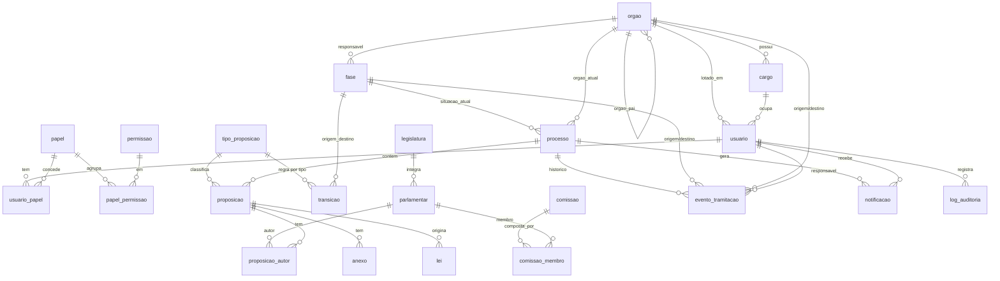

# Modelo de Dados — MVP (Fase 0 + Fase 1)

> Modelagem derivada de [`backlog-mvp.md`](backlog-mvp.md). O esquema executável está em
> [`db/schema.sql`](../db/schema.sql) e os dados iniciais em [`db/seed.sql`](../db/seed.sql)
> (PostgreSQL / Supabase).

## Diagrama de entidades



## Entidades (resumo)

| Entidade | Papel no sistema | Origem legal |
|----------|------------------|--------------|
| `orgao` | Estrutura em 4 graus (hierarquia via `orgao_pai_id`) | Lei 3.525/2025 |
| `cargo`, `usuario`, `papel`, `permissao` | Quem acessa e o que pode fazer | TIC (art. TIC) |
| `tipo_proposicao` | Regras por tipo (sanção, turnos, quórum) | proc. legislativo |
| `fase` + `transicao` | **Máquina de estados** regimental parametrizável | arts. 37, 20, 59 |
| `legislatura`, `parlamentar`, `comissao`, `comissao_membro` | Composições temporais | art. 22 |
| `processo` | **Contêiner** do protocolo ao arquivamento (situação/órgão atuais) | arts. 14, 37 |
| `proposicao` + `proposicao_autor` + `anexo` | Conteúdo legislativo e autoria | arts. 20, 35 |
| `evento_tramitacao` | **Histórico imutável**: tramitações, despachos, incidentes | arts. 37, 20 |
| `lei` | Cadastro de leis municipais | art. 37 |
| `notificacao` | Avisar autor/Presidente do andamento | arts. 37, 35 |
| `log_auditoria` | Trilha de auditoria (quem/o quê/quando) | TIC / LGPD |

## Decisões de modelagem

1. **`processo` × `proposicao`.** A `proposicao` é o *conteúdo* (texto, autoria); o `processo` é o
   *contêiner* que tramita (situação e órgão atuais, arquivamento). Isso separa **quem redige**
   (arts. 20/35) de **quem controla o trâmite** (art. 37) e permite, no futuro, **apensar** várias
   proposições a um mesmo processo.

2. **Rascunho × Protocolada.** `proposicao.status_edicao` controla a edição: enquanto `RASCUNHO`, o
   gabinete edita e não há número nem `processo`; ao **protocolar**, cria-se o `processo`, atribui-se
   número (`UNIQUE (tipo, numero, ano)`) e o texto "congela".

3. **Histórico imutável.** `evento_tramitacao` nunca é apagado/alterado; correções entram como novos
   eventos. A "situação atual" do `processo` é sempre o reflexo do último evento — é um **cache** para
   consulta rápida, não a fonte da verdade.

4. **Workflow parametrizável.** `fase` + `transicao` descrevem o fluxo (com prazos). Trocar o fluxo
   é dado, não código — atende ao "observando as fases e prazos regimentais" sem redeploy.

5. **Composições temporais.** Comissões e Mesa mudam por biênio; por isso `comissao` guarda o biênio
   e `parlamentar` a legislatura — o histórico de composições anteriores é preservado.

## Como aplicar (Supabase/Postgres)

```bash
psql "$DATABASE_URL" -f db/schema.sql
psql "$DATABASE_URL" -f db/seed.sql
```
> No Supabase, também é possível colar o conteúdo no SQL Editor. Recomenda-se, ao ir para produção,
> versionar como **migrations** e habilitar **RLS (Row Level Security)** por papel/órgão.

## Pontos a validar antes de congelar o modelo

- Numeração de protocolo: **reinicia por ano**? por tipo? há legado a importar?
- O fluxo de `fase`/`transicao` do seed bate com o **Regimento Interno**?
- Quórum/turnos por tipo conferem com a Lei Orgânica?
- Storage de anexos: Supabase Storage ou outro? (o `anexo.caminho` aponta para lá)

## Próximo passo

Com o modelo validado: escolher a stack de aplicação e implementar a **Fase 0 (cadastros)** seguida
do fluxo **E1.1 → E1.2 → E1.3** (registrar → protocolar → tramitar).
